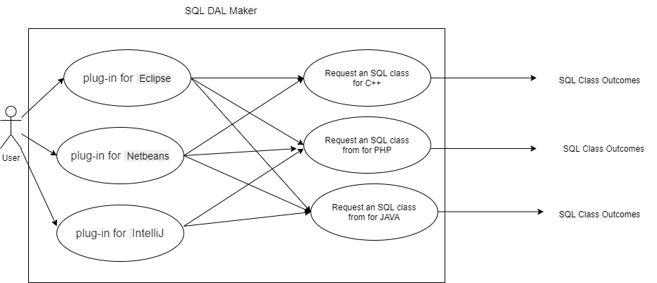

# SQL DAL Maker Project Proposal

## Project Abstract
SQL DAL Maker is a generator of DTO（Data Transfer Object） and DAO（Data Access Object） classes to access relational databases. Target programming languages: PHP, Java, C++, Python, Ruby. To generate the class, you declare it in XML meta-program. It is a plug-ins for Eclipse IDE, IntelliJ Platform, and NetBeans. SQL DAL Maker needs access to existing database. It may be a real database, its clone, snapshot, prototype, etc. the code is generated using metadata of SQL statements, tables, and views. Reading of metadata is performed through JDBC. It does not change database-schema and uses the current one AS-IS.

## Project Relevance
This is a Sourceforge projects. I had an open-source software structure. Thought extent function for this project, I can learn the knowledge about the project management, version control, coding, testing, and Issue tracking.

## Conceptual Design
Improve its compatibility under Apache NetBeans. Try to make it support generating more characteristic code.

## Background
The URL reference of the project list below:_

<https://sourceforge.net/projects/sqldalmaker>
<https://github.com/panedrone/sqldalmaker>

## Required Resources
Any JAVA IDE
